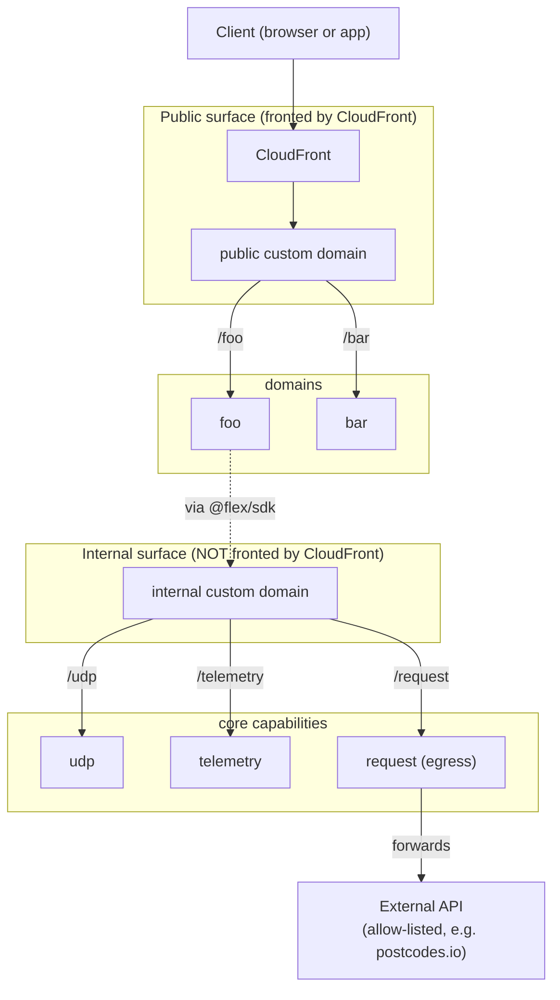

# flex-minipoc

A small, deployable proof of the Flex platform shape: one CloudFront front door
with a single static origin, an API Gateway custom domain that fans out by base
path to independent per-domain gateways, a folder-driven routing model, a thin
fragment SDK for core capabilities, and contributor domains that contain no AWS.

Everything runs in `us-east-1`. DNS is on Cloudflare, so AWS manages no records;
you create a few CNAMEs once.

## Ownership planes

Every top-level folder is an ownership boundary (see `CODEOWNERS`).

```
platform/              platform team: the edge and the build system
  front-door/stack.ts    CloudFront + the shared custom domain (one static origin)
  domains/stack.ts       the per-domain gateway builder
  domains/discover.ts    turns the domains/ tree into routes
core/                  flex-core capabilities, each team-owned
  udp/                   read/write store: stack.ts + handlers/ + sdk.ts (DynamoDB)
  telemetry/             write-only emit: stack.ts + handlers/ + sdk.ts (CloudWatch)
  request/               egress gateway: forwards allow-listed outbound calls
  http/                  SDK-only framework module: sdk.ts (createHandler)
  routes/                SDK-only framework module: sdk.ts (defineRoute)
  identity/              auth strategies: sdk.ts (names) + handlers/ (authorizer)
domains/               contributor business logic, no AWS
  <domain>/<path>/route.ts and/or handler.ts
external/              stand-ins for third-party systems (mock-dvla)
bin/app.ts             assembles the app from the folders above
```

## Topology

There are two surfaces. The **public surface** (CloudFront in front of a custom
domain) carries the domains. The **internal surface** (a second custom domain
that CloudFront does not front) carries the core capabilities, so they are
reachable by domains through the SDK but not through the public front door.
Outbound calls leave through the `request` egress gateway. All of this runs in
default networking; there is no VPC here (see the simplifications at the end).



**A modular monolith, by choice.** Everything lives in one repo today, but the
pieces are isolated, not entangled. Each domain and each core capability is its
own stack, owns its own folder and codeowners, and talks to the rest only
through the SDK, which is just an HTTPS endpoint. That isolation makes
extraction a small step rather than a rewrite: UDP could move to its own
repository and deploy on its own gateway or subdomain, and the only thing that
changes for a consumer is the endpoint the SDK resolves. The single repo is a
convenience for now, not a constraint.

Adding a domain touches nothing shared but its own base path mapping. CloudFront
never changes.

## Folders are the routes

There is no route list. `domains/<domain>/<...segments>/handler.ts` becomes
`GET /<domain>/<...segments>`:

```
domains/foo/v1/hello/handler.ts     -> GET /foo/v1/hello
domains/foo/v1/goodbye/handler.ts   -> GET /foo/v1/goodbye
domains/bar/v1/hello/handler.ts     -> GET /bar/v1/hello
```

A handler is plain domain logic. It returns data; it never sees AWS shapes,
because `@flex/sdk/http` adapts it:

```ts
import { createHandler } from "@flex/sdk/http";

export const handler = createHandler(() => ({ message: "hello from foo v1" }));
```

`handler.ts` is a `GET`; method-by-filename (`get.ts` / `post.ts`) is a small
extension.

Folders express routing and nothing more. Per-route controls, such as which
secrets, keys or resources a handler may use and least-privilege grants, have no
home in a folder. That is where the real platform's richer configuration is the
better fit, and it is a deliberate boundary of this POC rather than a claim that
folders beat configuration for everything.

## The SDK

A tsconfig path wildcard maps `@flex/sdk/*` to `core/*/sdk`, so every fragment
is importable with no central index to maintain:

```ts
import { createHandler } from "@flex/sdk/http";
import { udp } from "@flex/sdk/udp";
import { telemetry } from "@flex/sdk/telemetry";
import { request } from "@flex/sdk/request"; // outbound: request.get(url)
```

Each fragment is co-located with the capability it fronts and is independently
owned and versioned (the `@flex/sdk-udp`, `@flex/sdk-telemetry` model). The
platform injects each capability's URL into domain lambdas, so the SDK resolves
the transport without the domain knowing it.

Outbound calls go through `@flex/sdk/request`: a domain asks to fetch a URL and
the egress gateway forwards it, but only to hosts on a platform-maintained
allow-list (`core/request/allowlist.ts`). The domain never holds credentials,
never gets raw internet egress, and never knows the gateway exists.

Adding a capability: create `core/<name>/sdk.ts` (and `stack.ts` + `handlers/`
if it deploys a service). It is instantly importable as `@flex/sdk/<name>`.

## One-time setup

1. `npm install`
2. Pick three subdomains you own in Cloudflare: `app...` (public, CloudFront),
   `gw...` (public custom domain, CloudFront's origin), and `internal...` (the
   internal surface for core capabilities).
3. Request an ACM cert in **us-east-1** covering both (a wildcard is easiest),
   add the validation CNAME in Cloudflare (DNS only), wait for `ISSUED`:
   ```bash
   aws acm request-certificate --region us-east-1 \
     --domain-name '*.minipoc.yourdomain.com' --validation-method DNS
   ```
4. `cp config.example.ts config.ts` and set `CERT_ARN`, `PUBLIC_HOST`,
   `GATEWAY_HOST`, `INTERNAL_HOST`.
5. `aws sts get-caller-identity` and `npx cdk bootstrap aws://<account-id>/us-east-1`.

## Deploy

```bash
npm run deploy        # cdk deploy --all
```

After the first deploy, create these CNAMEs in Cloudflare, both **DNS only**
(grey cloud, or the proxy breaks the Host-based custom-domain match):

| Cloudflare record | Type  | Target                         |
| ----------------- | ----- | ------------------------------ |
| `PUBLIC_HOST`     | CNAME | `CloudFrontDomain` output      |
| `GATEWAY_HOST`    | CNAME | `GatewayTarget` output         |
| `INTERNAL_HOST`   | CNAME | `InternalTarget` output        |

## Add and remove (symmetric)

Add a function or domain by adding a folder, then deploy:

```bash
mkdir -p domains/bar/v1/status
printf 'import { createHandler } from "@flex/sdk/http";\nexport const handler = createHandler(() => ({ status: "ok" }));\n' \
  > domains/bar/v1/status/handler.ts
npm run deploy
```

Remove a domain by deleting its folder and syncing. `deploy:sync` deploys, then
prunes any deployed stack the app no longer defines:

```bash
rm -rf domains/zar
npm run deploy:sync
```

`prune` has a safety guard: if synthesis yields no stacks it aborts rather than
deleting live stacks. `npm run prune:dry` reports orphans without deleting.

## Test

```bash
curl https://app.minipoc.yourdomain.com/foo/v1/hello     # {"message":"hello from foo v1"}
curl https://app.minipoc.yourdomain.com/foo/v1/visit     # uses the UDP + telemetry SDK
```

A freshly added base path or route can take up to a minute to settle, returning
`Forbidden` or `Missing Authentication Token` until it does.

## Teardown

```bash
npm run destroy
```

Then remove the CNAMEs and the ACM validation record from Cloudflare and delete
the cert.

## Notes (POC simplifications)

- The public custom domain is CloudFront's single origin, so CloudFront never
  changes as domains come and go. If a base path errors, check the Host header.
- Core capabilities sit on a separate internal custom domain that CloudFront
  does not front, so they are not reachable from the public front door. In the
  POC that internal domain is still publicly resolvable by hostname; true
  isolation is the private gateway inside a VPC, which we hand-wave.
- The `request` egress gateway enforces its allow-list in code with default
  Lambda internet egress. Real Flex enforces egress at the network layer (a
  firewall with fixed egress IPs) so application code cannot bypass it.
- Core capabilities are unauthenticated here. Real Flex fronts them with the
  private gateway and IAM / SigV4. Do not store anything sensitive.
- A real front door would also carry the origin-verify WAF check and an
  authorizer; both are omitted to keep the POC minimal.

## Further reading

- `PRINCIPLES.md` — the principles this POC explores, and what it deliberately
  simplifies.
- `docs/execution-layer.md` — an open design question: where the platform runs
  pre and post domain logic, with the options and their fit.
