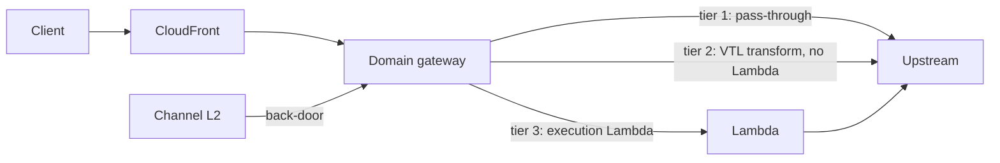

# Architecture

FLEX is one front door over many independently deployed gateways. The folder
structure is the architecture: the filesystem is the routing table, and adding a
capability is adding a folder.

## Top-level folders

| Folder | What it is |
| --- | --- |
| `domains/` | L1 resources. Each domain is its own deployed gateway. `dvla` is the full example, `simple` the minimal one. |
| `channels/` | L2 composition views. A channel fans several L1 calls into one response (`mobile` returns JSON, `testing` an HTML report). |
| `core/` | Platform capabilities and the SDK. Deployable services (`udp`, `telemetry`, `request`) plus SDK-only modules imported as `@flex/sdk/*` (`http`, `routes`, `transform`, `effects`, `events`, `identity`, `front-door`). Domains use these; they never touch AWS directly. |
| `platform/` | The edge and the build system: the front door (CloudFront + custom domains) and the builder that turns a folder of routes into a deployed gateway. |
| `front-door/` | The typed registry of L1 routes that channels compose against. |
| `bin/` | The CDK app entry: wires discovered domains and channels into stacks. |
| `scripts/` | Ops helpers (e.g. `prune` deletes stacks the app no longer defines). |
| `config.ts` | Hosts, region, cert. Gitignored values. |

## Inside a domain

A domain is organised by facet, each versioned on the axis it actually changes on:

```
domains/dvla/
  api/v1/            HTTP routes (client-version); api is stripped from the URL
    vehicle/         -> GET /dvla/v1/vehicle
    schema/          Zod contracts owned by the API
  events/v1/         event contracts this domain produces (event-version)
  subscriptions/     reactions (unversioned; each imports a versioned event)
```

## Request flow



- **Tier 1 pass-through:** the gateway forwards to the upstream. No compute.
- **Tier 2 transform:** the gateway reshapes the response with VTL. No Lambda.
- **Tier 3 execution:** a Lambda runs, and may run effects after it returns.
- **Channels (L2)** call L1 over the back-door (the gateway host directly).

## Contracts and events

- Every route declares a Zod `output`: it is both the typed client and the
  runtime drift check.
- Events are producer-owned typed contracts (`defineEvent`). The emitter emits
  against one; consumers import it and react as tolerant readers (`onEvent`). The
  version rides in the `detailType`, so v1 and v2 can circulate together.

See [how-to.md](how-to.md) for the steps to add each of these.
