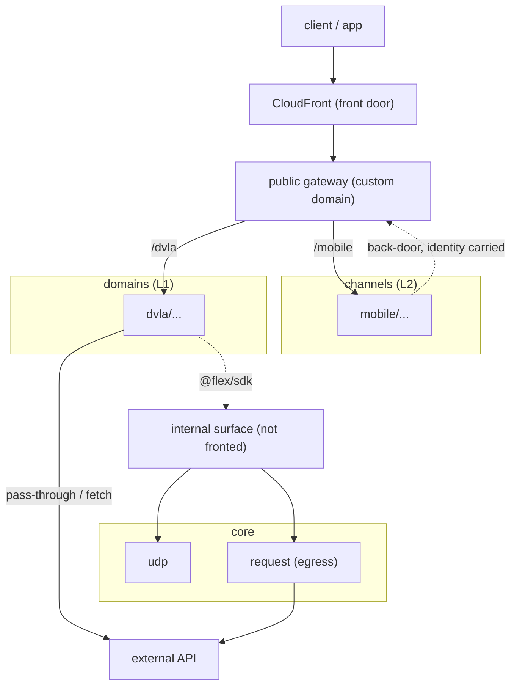

# Topology

How it is wired at runtime. One CloudFront distribution with a single static
origin sits in front of two API Gateway custom domains and routes by path.

## Layers

- **Front door (CloudFront).** One static origin, routes by path, unchanged as
  gateways come and go.
- **Public gateway.** Holds the base-path mappings for domains (`/dvla`) and
  channels (`/mobile`). Each gateway deploys itself.
- **Internal surface.** A second custom domain, not fronted by CloudFront, holds
  the core capabilities (`/udp`, `/telemetry`, `/request`). Reachable by code
  through the SDK, not from the public front door.
- **Authorizer.** Resolves the user's identity once at the gateway and passes it
  down as request context.
- **L1 domain.** Pass-through or a small lambda, to an upstream.
- **L2 channel.** Fans out to L1 resources through the back-door (the gateway
  host directly, identity carried down), composes, returns.
- **Egress.** Outbound calls leave through the `request` gateway against an
  allow-list.

## One request

`GET /mobile/dvla/driving-page`: the channel gateway resolves identity, the view
fans out in parallel to `/dvla/v1/user` and `/dvla/v1/vehicle`, each resolves to
its upstream, and the view assembles one response.
